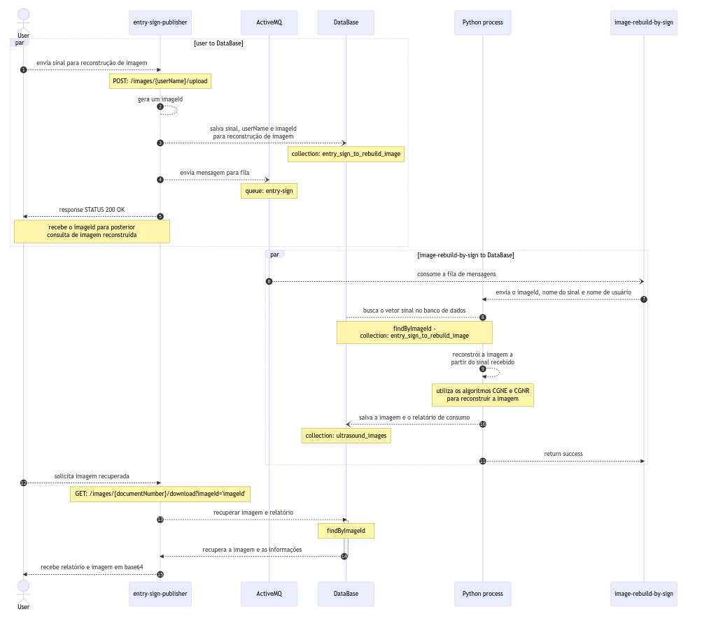

# Universidade Tecnológica Federal do Paraná - UTFPR
___
## Desenvolvimento Integrado de Sistemas - CSM30

Microsserviço responsável por consumir mensagens recebidas de uma fila (MessageBroker - ActiveMQ),
processar informações de sinal de entrada e matriz modelo realizando operações matémáticas em matrizes
para reconstruir uma imagem de ultrassom.

## Documentação
  Este microsserviço faz o processamento de vetor sinal de entrada e matriz modelo esparsa para reconstrução
  de imagem de ultrassom. Conecta-se com uma fila de mensagens (activeMQ), banco de dados não relacional (MongoDB)
  e utiliza um script python chamado como um processo para realizar as operações necessárias e reconstruir a imagem.

  Outro microsserviço é utilizado como api para expor endpoints que servem para envio de vetor sinal através de um
  método HTTP POST e recebimento de imagem através de um método HTTP GET. O microsseerviço
  ['entry-sign-publisher'](https://github.com/saulobergamo/entry-sign-publisher) tem a única responsabilidade de
  receber o sinal, salvar no banco de dados e enviar uma mensagem na fila indicando que um novo sinal foi recebido e
  uma nova imagem deve ser processada.

  Diagrama de sequência pode ser visualizado na pasta src/main/resources/images/SequenceDiagram.png ou
  pelo [Link](https://mermaid.live/edit#pako:eNqVVdtu00AQ_ZWVJYQQcXNpE1ILghpSoQq1DaR9KLJUrb2TdCV71-wlJK3yMYgHnnhCfEF-jNm1kzgFIZASxfHO7Zw5M_sQpJJBEAUaPlkQKYw4nSmaxyIWNDVSkQWhmlxrULEoqDI85QUVhpxOxu4AhFHLUPOZCAubZFzfPTY8OX_vDE9Sw-dw_n7_cDR0ZyNq6JBq2D8b37iz8dLcSUEKJVPQet_i7MNw4mx4TmcQKkgsz1iYlPV4BNZIYfPE1eRdiUUgxMhaykUYDgaIJkIsc06J5oJmBG0pUZBKoY2y62_rr5IwKDMhOUIaIHKOsbzn-HJyFZGmP9XNB5fkguawatoik5S55GiHibz1DDC2zctgZ4xsj5-NhhHRNJtXVTTIJhKBjfXLRA3-vToXMJVZBsi-FFHZrltHz62RtxVjt95vVwV2bENGDkK7mGXGKc9oPbo3RNlYiGpC2KEdLCKsUhdYJpDJ1cnV9YR0Wi1y-a4eZdEoSUQ8kOC7LS8-ZyG1AcWl8sAdYpsZukNbo-E7w-pAIN1PnhAq2CPt7Le9lMMflbNviCCREye1yKeX2I2SCldERZDQLqIzcrDHNxv-tmAaRDhHJit9QfUfsMV2_QUBugDjG3R3PUusTp33HNwIli5CkoSK1HeaUSZ1ncTxTcP5Tblgw-VZRWBIkLTm4D8E4Avw9W9oXf_gCLfimvp4xM-g2oHxneNM7hcUEWt4xu8RhyY0m0nFTY6Pb95enCJ-_PnwBzFjXLoVcllQbSy2lTidKMioWf9A7hwlXhq5_Jv6UTmKamlFhVjvIJf9VWCsEkTbtFw2dTFd1zZHUklotzu0zHArGVpTpS1wzhn9bVm8Pa3vCiZTiyIyF35NrZpMfhZuZ7yuhPPqafXwtDZXzx2yTQq142THyD4N5JEyXKjR0EUKN6PnQ9X5dXtVTKXKKe6XnyVX-4Ptx7XWhO1I4scx1Dvy5HkSYxE0ghwwGmd42zzEgpA4MHeQQxxE-MhgSrE_cRCLFZq6zT1ZijSIpjTT0AhswajZ3E6P3p4yjmOyfYl3w0cp8_r_IHoIFkEUHrWOD_qdw37_sNXt9Y5avUawdK_bnYP-8VGn_6LdOj580V01gnsfoXPQ6bW7x_httzrdfqeNDuCznZfXpr89V78AeDaQGQ)

  
### Pré-requisitos

O que será necessário instalar para que o microsserviço funcione corretamente

- Intellij IDEA
- Git
- Java 11
- Gradle
- ActiveMq
- MongoDB
- Python3
  - numpy
  - pandas
  - csv


### Instalação

Passo a passo de execução para que o microsserviço fique em execução e disponível para uso.

- Realizar o clone do projeto:

  Comando: ```git clone git@ssh.dev.azure.com:v3/alelo/Portador/ma-card-tracking-orch```

- Acessar a pasta do projeto:

  - Executar script para o docker compose:

    Comando: ```docker-compose up```


- Fazer o build do projeto:

  Comando: ```./gradlew build```


- Subir a aplicação local:

  Comando: ```./gradlew bootRun --args='--spring.profiles.active=dev'```

### Qualidade de código

- Executar inspeção com SonarQube:

  Comando: ```./cmds/build-sonar.sh```


- Executar inspeção com Spotless e Detekt:

  Comando: ```./gradlew spotlessCheck```


- Executar correção com Spotless e Detekt:

  Comando: ```./gradlew spotlessApply```
